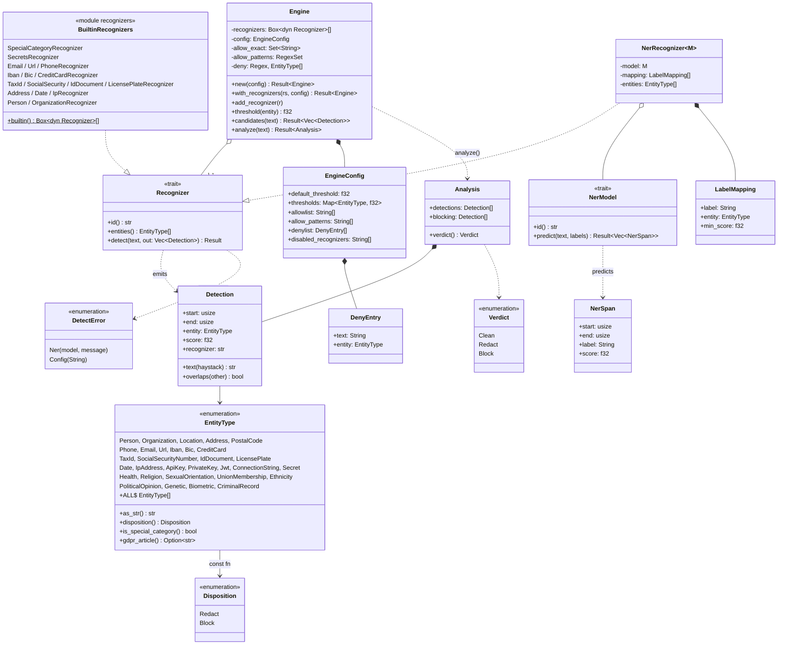

# Class diagram: detect

Entity model, the `Recognizer` plug-in point, the NER adapter and the `Engine`.

```mermaid
%% detect crate: entity model, recognizer plug-in point, engine.
classDiagram
  direction TB
  class EntityType {
    <<enumeration>>
    Person, Organization, Location, Address, PostalCode
    Phone, Email, Url, Iban, Bic, CreditCard
    TaxId, SocialSecurityNumber, IdDocument, LicensePlate
    Date, IpAddress, ApiKey, PrivateKey, Jwt, ConnectionString, Secret
    Health, Religion, SexualOrientation, UnionMembership, Ethnicity
    PoliticalOpinion, Genetic, Biometric, CriminalRecord
    +ALL$ EntityType[]
    +as_str() str
    +disposition() Disposition
    +is_special_category() bool
    +gdpr_article() Option~str~
  }
  class Disposition {
    <<enumeration>>
    Redact
    Block
  }
  class Detection {
    +start: usize
    +end: usize
    +entity: EntityType
    +score: f32
    +recognizer: str
    +text(haystack) str
    +overlaps(other) bool
  }
  class Recognizer {
    <<trait>>
    +id() str
    +entities() EntityType[]
    +detect(text, out: Vec~Detection~) Result
  }
  class DetectError {
    <<enumeration>>
    Ner(model, message)
    Config(String)
  }
  class EngineConfig {
    +default_threshold: f32
    +thresholds: Map~EntityType, f32~
    +allowlist: String[]
    +allow_patterns: String[]
    +denylist: DenyEntry[]
    +disabled_recognizers: String[]
  }
  class DenyEntry {
    +text: String
    +entity: EntityType
  }
  class Engine {
    -recognizers: Box~dyn Recognizer~[]
    -config: EngineConfig
    -allow_exact: Set~String~
    -allow_patterns: RegexSet
    -deny: Regex, EntityType[]
    +new(config) Result~Engine~
    +with_recognizers(rs, config) Result~Engine~
    +add_recognizer(r)
    +threshold(entity) f32
    +candidates(text) Result~Vec~Detection~~
    +analyze(text) Result~Analysis~
  }
  class Analysis {
    +detections: Detection[]
    +blocking: Detection[]
    +verdict() Verdict
  }
  class Verdict {
    <<enumeration>>
    Clean
    Redact
    Block
  }
  class BuiltinRecognizers {
    <<module recognizers>>
    SpecialCategoryRecognizer
    SecretsRecognizer
    Email / Url / PhoneRecognizer
    Iban / Bic / CreditCardRecognizer
    TaxId / SocialSecurity / IdDocument / LicensePlateRecognizer
    Address / Date / IpRecognizer
    Person / OrganizationRecognizer
    +builtin()$ Box~dyn Recognizer~[]
  }
  class NerModel {
    <<trait>>
    +id() str
    +predict(text, labels) Result~Vec~NerSpan~~
  }
  class NerRecognizer~M~ {
    -model: M
    -mapping: LabelMapping[]
    -entities: EntityType[]
  }
  class LabelMapping {
    +label: String
    +entity: EntityType
    +min_score: f32
  }
  class NerSpan {
    +start: usize
    +end: usize
    +label: String
    +score: f32
  }

  EntityType --> Disposition : const fn
  Detection --> EntityType
  Recognizer ..> Detection : emits
  Recognizer ..> DetectError : fails closed
  BuiltinRecognizers ..|> Recognizer
  NerRecognizer ..|> Recognizer
  NerRecognizer o-- NerModel
  NerRecognizer *-- LabelMapping
  NerModel ..> NerSpan : predicts
  Engine o-- "1..*" Recognizer
  Engine *-- EngineConfig
  EngineConfig *-- DenyEntry
  Engine ..> Analysis : analyze()
  Analysis *-- Detection
  Analysis ..> Verdict
```
