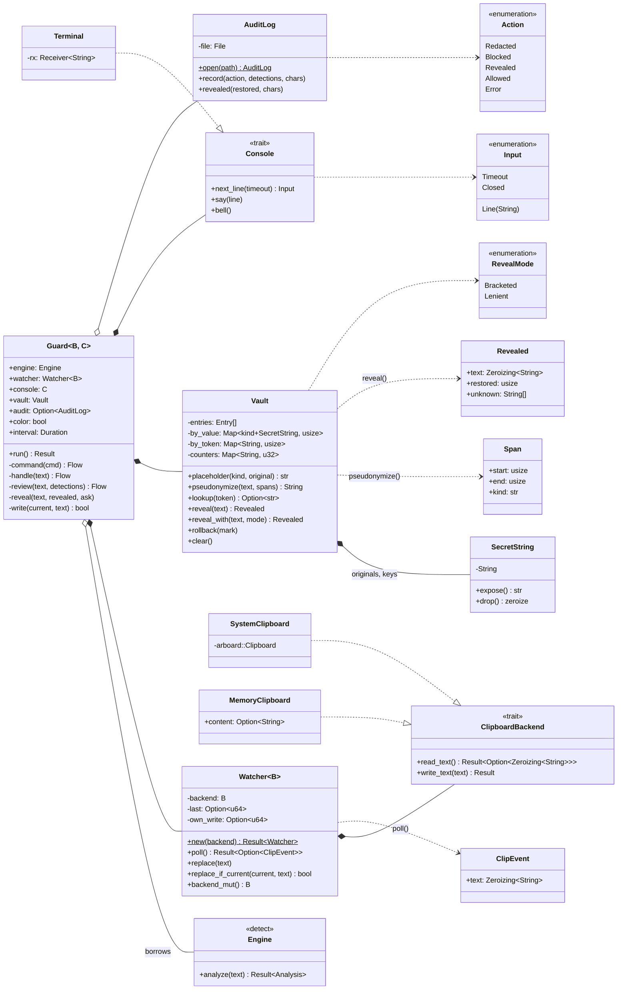

# Class diagram: guard runtime

`cli::guard`, `clip` and `vault`: the types that run the clipboard guard.

```mermaid
%% Runtime of the clipboard guard: clip, vault and the cli guard loop.
classDiagram
  direction LR
  class Guard~B, C~ {
    +engine: Engine
    +watcher: Watcher~B~
    +console: C
    +vault: Vault
    +audit: Option~AuditLog~
    +color: bool
    +interval: Duration
    +run() Result
    -command(cmd) Flow
    -handle(text) Flow
    -review(text, detections) Flow
    -reveal(text, revealed, ask)
    -write(current, text) bool
  }
  class Console {
    <<trait>>
    +next_line(timeout) Input
    +say(line)
    +bell()
  }
  class Terminal {
    -rx: Receiver~String~
  }
  class Input {
    <<enumeration>>
    Line(String)
    Timeout
    Closed
  }
  class AuditLog {
    -file: File
    +open(path)$ AuditLog
    +record(action, detections, chars)
    +revealed(restored, chars)
  }
  class Action {
    <<enumeration>>
    Redacted
    Blocked
    Revealed
    Allowed
    Error
  }
  class Watcher~B~ {
    -backend: B
    -last: Option~u64~
    -own_write: Option~u64~
    +new(backend)$ Result~Watcher~
    +poll() Result~Option~ClipEvent~~
    +replace(text)
    +replace_if_current(current, text) bool
    +backend_mut() B
  }
  class ClipboardBackend {
    <<trait>>
    +read_text() Result~Option~Zeroizing~String~~~
    +write_text(text) Result
  }
  class SystemClipboard {
    -arboard::Clipboard
  }
  class MemoryClipboard {
    +content: Option~String~
  }
  class ClipEvent {
    +text: Zeroizing~String~
  }
  class Vault {
    -entries: Entry[]
    -by_value: Map~kind+SecretString, usize~
    -by_token: Map~String, usize~
    -counters: Map~String, u32~
    +placeholder(kind, original) str
    +pseudonymize(text, spans) String
    +lookup(token) Option~str~
    +reveal(text) Revealed
    +reveal_with(text, mode) Revealed
    +rollback(mark)
    +clear()
  }
  class SecretString {
    -String
    +expose() str
    +drop() zeroize
  }
  class Span {
    +start: usize
    +end: usize
    +kind: str
  }
  class Revealed {
    +text: Zeroizing~String~
    +restored: usize
    +unknown: String[]
  }
  class RevealMode {
    <<enumeration>>
    Bracketed
    Lenient
  }

  Guard o-- Engine : borrows
  Guard *-- Watcher
  Guard *-- Vault
  Guard *-- Console
  Guard o-- AuditLog
  Terminal ..|> Console
  Console ..> Input
  AuditLog ..> Action
  Watcher *-- ClipboardBackend
  Watcher ..> ClipEvent : poll()
  SystemClipboard ..|> ClipboardBackend
  MemoryClipboard ..|> ClipboardBackend
  Vault *-- SecretString : originals, keys
  Vault ..> Span : pseudonymize()
  Vault ..> Revealed : reveal()
  Vault ..> RevealMode
  class Engine {
    <<detect>>
    +analyze(text) Result~Analysis~
  }
```
