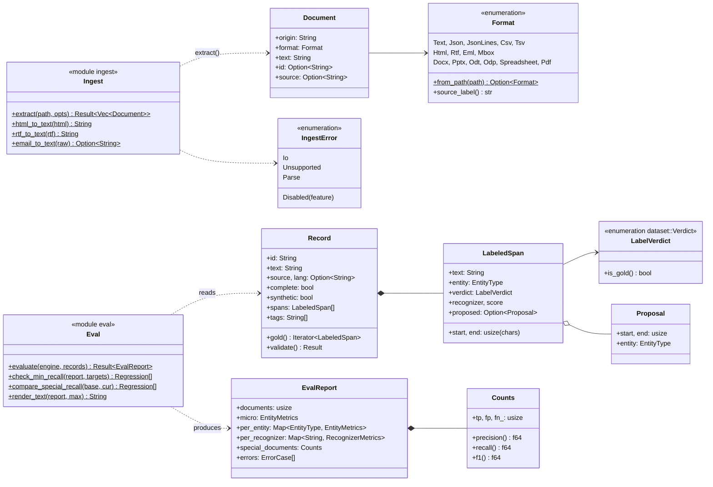

# Class diagram: ingest and dataset

Offline tooling behind `scan`, `label` and `eval`.

```mermaid
%% Offline tooling: ingest and dataset (used by scan, label, eval).
classDiagram
  direction LR
  class Format {
    <<enumeration>>
    Text, Json, JsonLines, Csv, Tsv
    Html, Rtf, Eml, Mbox
    Docx, Pptx, Odt, Odp, Spreadsheet, Pdf
    +from_path(path)$ Option~Format~
    +source_label() str
  }
  class Document {
    +origin: String
    +format: Format
    +text: String
    +id: Option~String~
    +source: Option~String~
  }
  class Ingest {
    <<module ingest>>
    +extract(path, opts)$ Result~Vec~Document~~
    +html_to_text(html)$ String
    +rtf_to_text(rtf)$ String
    +email_to_text(raw)$ Option~String~
  }
  class IngestError {
    <<enumeration>>
    Io
    Unsupported
    Disabled(feature)
    Parse
  }
  class Record {
    +id: String
    +text: String
    +source, lang: Option~String~
    +complete: bool
    +synthetic: bool
    +spans: LabeledSpan[]
    +tags: String[]
    +gold() Iterator~LabeledSpan~
    +validate() Result
  }
  class LabeledSpan {
    +start, end: usize (chars)
    +text: String
    +entity: EntityType
    +verdict: LabelVerdict
    +recognizer, score
    +proposed: Option~Proposal~
  }
  class LabelVerdict {
    <<enumeration dataset::Verdict>>
    +is_gold() bool
  }
  class Proposal {
    +start, end: usize
    +entity: EntityType
  }
  class Eval {
    <<module eval>>
    +evaluate(engine, records)$ Result~EvalReport~
    +check_min_recall(report, targets)$ Regression[]
    +compare_special_recall(base, cur)$ Regression[]
    +render_text(report, max)$ String
  }
  class EvalReport {
    +documents: usize
    +micro: EntityMetrics
    +per_entity: Map~EntityType, EntityMetrics~
    +per_recognizer: Map~String, RecognizerMetrics~
    +special_documents: Counts
    +errors: ErrorCase[]
  }
  class Counts {
    +tp, fp, fn_: usize
    +precision() f64
    +recall() f64
    +f1() f64
  }

  Ingest ..> Document : extract()
  Ingest ..> IngestError
  Document --> Format
  Record *-- LabeledSpan
  LabeledSpan --> LabelVerdict
  LabeledSpan o-- Proposal
  Eval ..> Record : reads
  Eval ..> EvalReport : produces
  EvalReport *-- Counts
```
