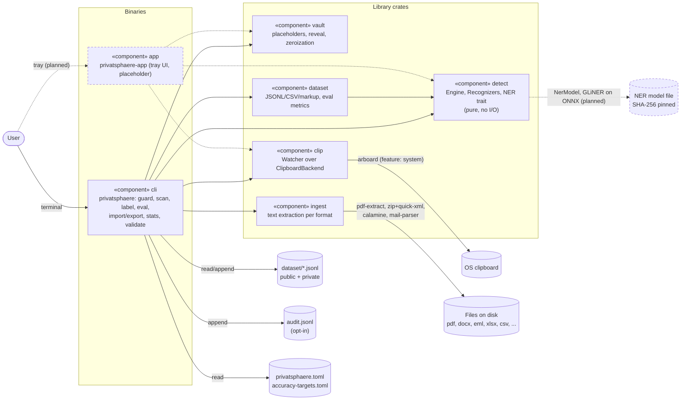

# Components

Workspace crates, their dependencies and what each one touches. Dashed parts are planned (tray app, NER model).

```mermaid
%% Component view of the privatsphaere workspace (crates and external boundaries).
flowchart LR
  user(["User"])
  osclip[("OS clipboard")]
  files[("Files on disk<br/>pdf, docx, eml, xlsx, csv, ...")]
  ds[("dataset/*.jsonl<br/>public + private")]
  auditf[("audit.jsonl<br/>(opt-in)")]
  cfg[("privatsphaere.toml<br/>accuracy-targets.toml")]
  model[("NER model file<br/>SHA-256 pinned")]

  subgraph bins["Binaries"]
    direction TB
    cli["«component» cli<br/>privatsphaere: guard, scan, label, eval,<br/>import/export, stats, validate"]
    app["«component» app<br/>privatsphaere-app (tray UI, placeholder)"]
  end

  subgraph libs["Library crates"]
    direction TB
    detect["«component» detect<br/>Engine, Recognizers, NER trait<br/>(pure, no I/O)"]
    vault["«component» vault<br/>placeholders, reveal, zeroization"]
    clip["«component» clip<br/>Watcher over ClipboardBackend"]
    ingest["«component» ingest<br/>text extraction per format"]
    dataset["«component» dataset<br/>JSONL/CSV/markup, eval metrics"]
  end

  user -- "terminal" --> cli
  user -. "tray (planned)" .-> app

  cli --> detect
  cli --> vault
  cli --> clip
  cli --> ingest
  cli --> dataset
  dataset --> detect
  app -.-> detect
  app -.-> vault
  app -.-> clip

  clip -- "arboard (feature: system)" --> osclip
  ingest -- "pdf-extract, zip+quick-xml,<br/>calamine, mail-parser" --> files
  cli -- "read/append" --> ds
  cli -- "append" --> auditf
  cli -- "read" --> cfg
  detect -. "NerModel, GLiNER on ONNX (planned)" .-> model

  classDef planned stroke-dasharray: 5 4;
  class app,model planned;
```
