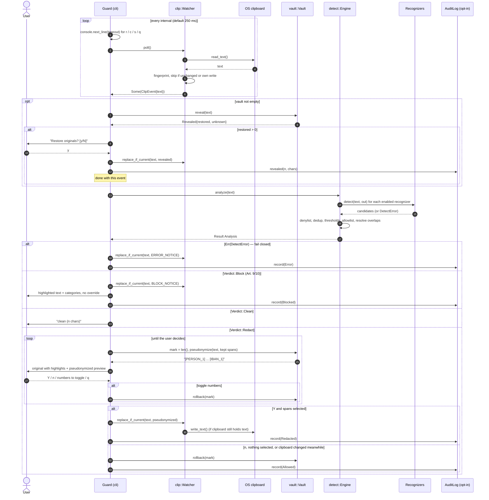

# Sequence: clipboard detection flow

One clipboard change in `privatsphaere guard` (review mode).

```mermaid
%% privatsphaere guard: one clipboard change in review mode.
sequenceDiagram
  autonumber
  actor U as User
  participant G as Guard (cli)
  participant W as clip::Watcher
  participant OS as OS clipboard
  participant V as vault::Vault
  participant E as detect::Engine
  participant R as Recognizers
  participant A as AuditLog (opt-in)

  loop every interval (default 250 ms)
    G->>G: console.next_line(timeout) for r / c / s / q
    G->>W: poll()
    W->>OS: read_text()
    OS-->>W: text
    W->>W: fingerprint, skip if unchanged or own write
    W-->>G: Some(ClipEvent{text})
  end

  opt vault not empty
    G->>V: reveal(text)
    V-->>G: Revealed{restored, unknown}
    alt restored > 0
      G->>U: "Restore originals? [y/N]"
      U-->>G: y
      G->>W: replace_if_current(text, revealed)
      G->>A: revealed(n, chars)
      Note over G: done with this event
    end
  end

  G->>E: analyze(text)
  E->>R: detect(text, out) for each enabled recognizer
  R-->>E: candidates (or DetectError)
  E->>E: denylist, dedup, thresholds, allowlist, resolve overlaps
  E-->>G: Result Analysis

  alt Err(DetectError) — fail closed
    G->>W: replace_if_current(text, ERROR_NOTICE)
    G->>A: record(Error)
  else Verdict::Block (Art. 9/10)
    G->>W: replace_if_current(text, BLOCK_NOTICE)
    G->>U: highlighted text + categories, no override
    G->>A: record(Blocked)
  else Verdict::Clean
    G->>U: "clean (n chars)"
  else Verdict::Redact
    loop until the user decides
      G->>V: mark = len(), pseudonymize(text, kept spans)
      V-->>G: "[PERSON_1] ... [IBAN_1]"
      G->>U: original with highlights + pseudonymized preview
      U-->>G: Y / n / numbers to toggle / q
      alt toggle numbers
        G->>V: rollback(mark)
      end
    end
    alt Y and spans selected
      G->>W: replace_if_current(text, pseudonymized)
      W->>OS: write_text() (if clipboard still holds text)
      G->>A: record(Redacted)
    else n, nothing selected, or clipboard changed meanwhile
      G->>V: rollback(mark)
      G->>A: record(Allowed)
    end
  end
```
